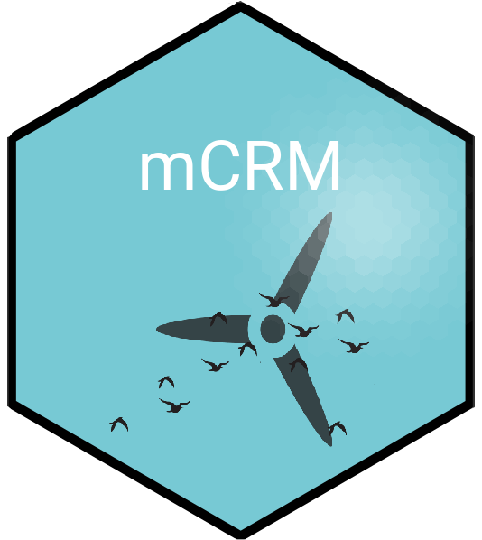

<!-- README.md is generated from README.Rmd. Please edit that file -->

# mCRM 

## A Shiny app to model collision risk of migratory birds in offshore wind farms

<!-- badges: start -->

[](https://lifecycle.r-lib.org/articles/stages.html#experimental)
<!-- badges: end -->

## Installation

You can install the github version of mCRM from here with:

``` r
devtools::install_github("HiDef-Aerial-Surveying/mCRM")
```

## mCRM usage (local)

Once installed as a package, the mCRM can be run like this:

``` r
mCRM::runApp()
```

## mCRM usage (online)

You can access the mCRM on shinyapps.io:
<https://hidefdevo.shinyapps.io/mCRM/>

## Using the interface

Instructions on running the tool can be found at
<https://hidef-aerial-surveying.github.io/mCRM/>

## Information

The stochastic migration collision risk model (mCRM) shiny app was
developed by HiDef Aerial Surveying for Marine Scotland Science. This
tool is meant to be used to estimate the collision risk of migratory
birds passing through offshore windfarms.

The underlying functionality of the model is driven by the `stochLAB`
package, which can be found at
<https://github.com/HiDef-Aerial-Surveying/stochLAB>. The stochLAB
package was developed by [DMP statistics](https://github.com/dmpstats)
and [HiDef Surveying](https://github.com/Hidef-Aerial-Surveying).

This tool is partnered with the stochastic collision risk model (sCRM)
tool, developed by [DMP statistics](https://github.com/dmpstats), which
is currently under development and will be deployed soon.
