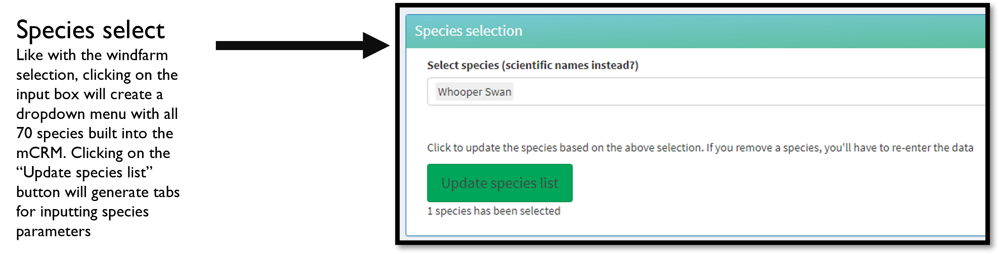
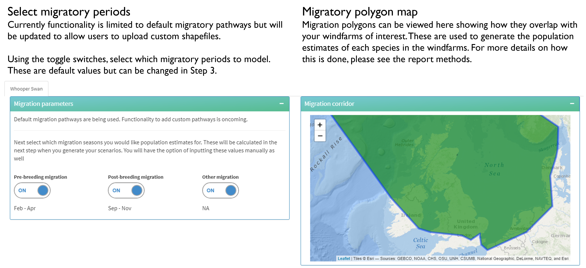
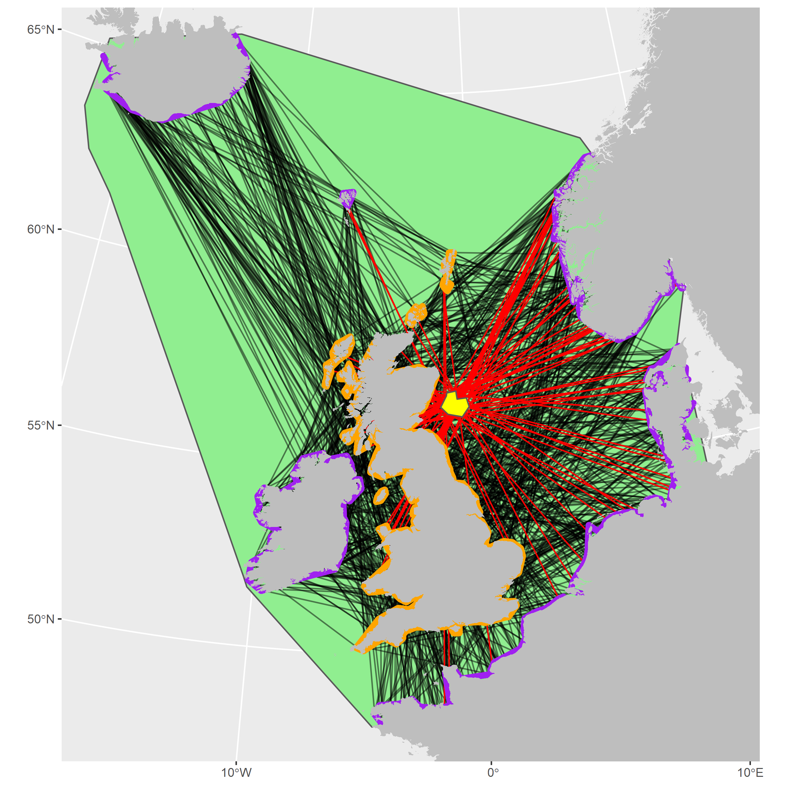

<!-- badges: start -->

<!-- badges: end -->

## mCRM R Shiny user guide  

The migration collision risk model (mCRM) shiny application is a stochastic adaptation of the Band (2012) migration collision risk worksheet.  The tool can be found at <a href="https://hidefdevo.shinyapps.io/mCRM" target="_blank">https://hidefdevo.shinyapps.io/mCRM</a> .   
The web application is a wrapper around the `r mig_stoch_crm()` function in the `{stochLAB}` package <a target="_blank" href="https://www.github.com/HiDef-Aerial-Surveying/stochLAB">https://www.github.com/HiDef-Aerial-Surveying/stochLAB</a>. The web application contains default values for 70 species of migratory birds as well as polygons that represent their approximate migratory pathways. The mCRM tool does a couple of things:
* Creates population estimates in wind farms by sampling migratory pathways via straight lines drawn between UK and non-UK coastlines
* Runs a stochastic version of the migratory collision risk model based on the population estimates and user-input parameters. 


## The main interface 


In the main interface, you'll see a couple of buttons across the header at the top. The "hamburger" (three horizontal lines) can be used to hide the sidebar. Clicking on the version number will take you to the [Github NEWS page](https://github.com/HiDef-Aerial-Surveying/mCRM/blob/master/NEWS.md). The "Github" logo (looks like a cat) will take you to the [github repo](https://github.com/HiDef-Aerial-Surveying/mCRM). And if you want to report a bug, you could click on the bug, which would take you to the [Issues page](https://github.com/HiDef-Aerial-Surveying/mCRM/issues).

In the sidebar, you will see the four steps to follow to generate your models. When you open the application, you start on Step 1: Turbine & Wind farm features, which you will see in the main display window. 

## Step 1: Turbine & Wind farm features


First choose if you want to use the built-in list of windfarm polygons, or if you want to use a custom shapefile.  
Click on the "select wind farms" input box to bring up the dropdown menu.  When the wind farms are selected, click the "update windfarm list" button.  
To delete a windfarm from the list, simply click on it and hit DELETE on your keyboard, then click the "update windfarm list" button again.  

### Using a custom shapefile


First, create a polygon shapefile that has a NAME field. Every polygon in your shapefile should have a UNIQUE identifier in the NAME field.  

  

Select the dropdown option for "custom windfarms" and then click "Browse".  
***Ensure that you select all the files associated with the shapefile*** 


Click on the Load Shapefile button to bring up the new dropdown list with the new windfarm names.

Click on Update Windfarm List and the tabs with the windfarm data will be generated.


### Wind farm parameters

After clicking the "Update windfarm list" button, tabs will appear on the screen. Each tab contains inputs for the parameters associated with the wind farms.  


The inputs are filled with default values but can be updated based on specifics for the wind farms.   

To update the data table, simply double click on it and it will open in editing mode. Hit ***CTRL + Enter*** to finish editing. 

***NOTE*** Although migration collision risk is only calculated assuming birds travel 
through a site once (not multiple times over months), monthly assignments are used 
to take an average of the available wind speed in the site (i.e., average activity of 
turbine blades). I.E., if the migratory period lies between March and June, then the 
average wind availability for the turbines is used in the calculation of collision risk. 
This value has negligible impact on the overall collision risk when compared to other 
elements (e.g., avoidance rates), but was incorporated to keep with conventions in the 
standard stochastic collision risk model. 


## Step 2: Species features

Clicking on the sidebar tab "Step 2: Species features" will bring you to the Species selection page.  As per the windfarm selection step, click on the dropdown input box to bring up a list of species.  

 

Select species and click on the "update species list" button.  This will generate a series of tabs for each species where you can input the species parameters to use in the model. Many of the species parameters are already input, but any of these can be altered as needed.  

## Migratory pathway and period

Using the toggles for each species, you can select which migratory periods will be modelled. The migratory pathways are visualized in the right-hand map which shows how the pathways overlap with your chosen windfarms. 

  

  


## Step 3: Generate scenarios

Clicking on step 3, you can now generate population scenarios that will be fed forward into the mCRM.  For every species x windfarm combination, a set of lines drawn through the migratory polygons that extend from the UK to "elsewhere" is sampled and the proportion of that sample that intersects the windfarm polygon is used to calculate a potential population estimate within the windfarm footprints.

   

If your species and windfarm parameters are set, then clicking the "generate scenarios" button (the green cog) will start the bootstrapping process.  

   

Once the scenarios are generated, ***it is recommended that you download the worksheet***. This will help with reproducibility and for debugging. It will also mean that you can bypass steps 1 and 2 and simply upload your scenarios, then run the tool. 

### Calculation of population estimates

Estimates of the population size are done by way of a bootstrapping exercise where lines are 
randomly generated through a migration corridor. Migration corridors as polygon 
shapefiles were generated by the British Trust for Ornithology and are built into 
the tool in the "all_polygons.rda" object, which can be found in the "data" folder
in the [Github repository](https://www.github.com/hidef-aerial-surveying/mCRM). 

First, a series of points spaced 1km apart were generated around England, Scotland (including Shetland), and Wales (UK points) representing one set of origin or departure points. Then a series of points were generated around Iceland, continental Europe, and in the North Atlantic randomly (to ensure birds arriving from the North Atlantic were captured) to represent another 
set of origin or departure points (non-UK points).

<div style="text-align:center;">

</div>

For each species in the database, a migratory corridor polygon shapefile is used 
to clip the UK and non-UK points.

<div style="text-align:center;">

</div>

Ten thousand (10,000) random lines were generated between the UK and non-UK points to 
create a sampling of the areas where birds could potentially migrate. NOTE: These lines 
do not represent the actual tracks that birds would take, but instead are meant to be 
interpreted as spatial samplers to generate population estimates.  

<div style="text-align:center;">

</div>

To generate the population estimate, 1000 of the 10,000 lines are randomly sampled 
1000 times. The proportion of of sampled lines that overlap the wind farm development 
footprint represents the proportion of the population that might pass through the 
region. E.g., if 25 of 1000 lines (i.e., 2.5%) overlapped the wind farm footprint, and our 
migratory population was 25,000 birds, then 625 birds could potentially pass over the 
footprint. 

<div style="text-align:center;">

</div>

To maximize computational time, the 10,000 lines for each species have been pre-computed 
and stored in "all_lines.rda". They are drawn upon when the user selects a species and used 
in the background.

### Sample code for generating lines

The sampled lines were generated using the following code. The data files can be found in 
the "data-raw" folder on the Github repository. 


```r

library(sf)
library(rgeos)
library(sp)
library(raster)
library(ggplot2)
library(foreach)

GetSampleProp <- function(maskedlines,samplesize,WFarea){
  testsample <- sample(length(maskedlines[[1]]),samplesize,replace=T)
  testsample <- maskedlines[[1]][testsample]
  tt <- testsample[WFarea]
  return(tt)
}


load("data/all_polygons.rda")
load("data-raw/Non_UK_Points.Rda")
load("data-raw/UK_Points.Rda")

nLines <- 10000

UK_points <- sf::st_as_sf(UK_points)
UK_points <- sf::st_transform(UK_points,st_crs(32630)$proj4string)
Non_UK_points <- sf::st_as_sf(Non_UK_points)
Non_UK_points <- sf::st_transform(Non_UK_points,st_crs(32630)$proj4string)

NWeurope <- sf::read_sf("data-raw/Europe_coastline_poly.shp")
NWeurope <- sf::st_transform(NWeurope,st_crs(32630)$proj4string)

WFarea <- sf::read_sf("data/Wind_Farm_Area_East.shp")
WFarea <- sf::st_transform(WFarea,sf::st_crs(32630)$proj4string)


all_lines <- list()

for(j in 1:length(all_polygons)){
  spname <- names(all_polygons)[j]
  print(spname)
  outshp <- all_polygons[[j]]
  outshp <- sf::st_transform(outshp,st_crs(32630)$proj4string)
  
  UK_points_sample <- sf::st_intersection(UK_points,outshp) # UK_points[outshp,]
  Non_UK_points_sample <- sf::st_intersection(Non_UK_points,outshp)# Non_UK_points[outshp,]
  
  if(nrow(UK_points_sample)>0 & nrow(Non_UK_points_sample)>0){
    system.time({
      lineobjs <- lapply(1:nLines,function(x){
        UKsample <- sf::st_coordinates(UK_points_sample)[sample(1:nrow(sf::st_coordinates(UK_points_sample)),1,replace = T),]
        NonUKsample <- sf::st_coordinates(Non_UK_points_sample)[sample(1:nrow(sf::st_coordinates(Non_UK_points_sample)),1,replace = T),]
        line1_x <- c(UKsample[1],NonUKsample[1])
        line1_y <- c(UKsample[2],NonUKsample[2])
        line_obj <- sp::Line(cbind(line1_x,line1_y))
        lines_obj <- sp::Lines(list(line_obj),ID=paste0("Line_",x))
        return(lines_obj)
      })
      sampledLines <- sp::SpatialLines(lineobjs)
    })
    
    #sampledLines <- as(sampledLines,"Spatial")
    projection(sampledLines) <- sf::st_crs(32630)$proj4string
    sfLines <- as(sampledLines,"sf")
    
    maskedlines <- drtplanr::drt_mask(sfLines,outshp)
    maskedlines <- maskedlines %>% st_cast("LINESTRING")
    
    all_lines[[spname]] <- maskedlines
    
    G <- ggplot() +
      geom_sf(data=outshp,fill='lightgreen')+
      geom_sf(data=maskedlines,color=rgb(0,0,0,0.5))+
      geom_sf(data=NWeurope,fill='grey',color="black")+
      coord_sf(xlim=c(-459070,1433076),ylim=c(5321248,7364111))

    
    outname <- paste0("data/",spname,".png")
    ggsave(G,filename=outname,width=8,height=8,device="png",type="cairo-png")
  }else{
    print(paste("WARNING!!!", i))
  }
}


maskedLines <- all_lines$Anas_crecca


boot.iters <- 1000
samplesize <- 1000

sampleproportions <- foreach(i=1:boot.iters,.combine='c') %do%{
  tt <- GetSampleProp(maskedlines,samplesize,WFarea)
  return(length(tt)/samplesize)
}


```


### Uploading scenarios  

***We recommend that you download the scenario worksheet for this***.  Once you have downloaded the worksheet, parameters can be changed easily via Excel. When you have multiple scenarios you want to run, this is more efficient than changing parameters in the tool itself.  
***The worksheet MUST have the exact same header names and format as the downloaded worksheet in order to run***

    

When ready, click on the "Upload scenarios" button and select the xlsx you generated. 

## Step 4: Simulation & Results

When the scenarios have either been uploaded or generated in Step 3, head to Step 4 and click on the "Run scenarios" button. This will run the mCRM.  

   

The estimated number of collisions per season are visualized as data tables and organized by wind farm. Clicking on the "Download tables" button will create an Excel spreadsheet that contains all the inputs, and outputs (summary tables and full bootstrap outputs). A PDF report can also be generated that presents some summary graphics as well.  


## Running it as a script 

The tool itself is simply a wrapper around the `mig_stoch_crm()` function in the `stochLAB` library. The stochLAB library can either be installed by: 
`devtools::install_github("HiDef-Aerial-Surveying/stochLAB")` or by `install.packages("stochLAB")`.  

More information on using this function can be found on [the Github  site](https://www.github.com/hidef-aerial-surveying/stochLAB)

Below is an example of how you might run the tool for multiple scenarios.  

```r
##############################################################################
## Running the stochastic migration collision risk model
## WP3
## Grant Humphries. March 2022
################################

# Read libraries ----------------------------------------------------------
library(stochLAB)
library(tidyverse)
library(foreach)
library(readxl)


# sum stdev function ------------------------------------------------------
sum.stdevs <- function(x){
  return(sqrt(sum(sapply(x,function(x) x^2),na.rm=T)))
}

# Read worksheet tables ---------------------------------------------------
Datasheet <- "Scenarios/Scenarios.xlsx"

TurbineDat <- read_xlsx(Datasheet,sheet="TurbineData")
BirdDat <- read_xlsx(Datasheet,sheet = "BirdData")
CountDat <- read_xlsx(Datasheet, sheet="CountData")

# Loop through scenarios and apply data transformations -------------------

names(BirdDat) <- str_replace_all(names(BirdDat)," ","")
names(TurbineDat) <- str_replace_all(names(TurbineDat)," ","")
names(CountDat) <- str_replace_all(names(CountDat)," ","")

mcrmOut <- list(
  mCRM_output_ls = NULL,
  mCRM_boots_ls = NULL
)

outputs <- matrix(nrow=nrow(CountDat),ncol=11)

for(i in 1:nrow(CountDat)){
  print(paste0(i,"/",nrow(CountDat)))
  spp_name <- as.character(CountDat$Species[i])
  wf_name <- as.character(CountDat$Windfarm[i])
  BirdData <- BirdDat %>% dplyr::filter(Species == spp_name)
  TurbineData <- TurbineDat %>% dplyr::filter(Windfarm == wf_name)
  CountData <- CountDat[i,]
  ### Split the months to get start and end months for the season_specs table
  ssPrB <- strsplit(BirdData$PrBMigration," - ")[[1]]
  if(length(ssPrB)>1){
    PrBSt <- ssPrB[1]
    PrBEn <- ssPrB[2]
  }else{
    PrBSt <- NA
    PrBEn <- NA
  }
  ssPoB <- strsplit(BirdData$PoBMigration," - ")[[1]]
  if(length(ssPoB)>1){
    PoBSt <- ssPoB[1]
    PoBEn <- ssPoB[2]
  }else{
    PoBSt <- NA
    PoBEn <- NA
  }
  ssO <- strsplit(BirdData$OMigration," - ")[[1]]
  if(length(ssO)>1){
    OSt <- ssO[1]
    OEn <- ssO[2]
  }else{
    OSt <- NA
    OEn <- NA
  }
  season_specs <- data.frame(
    season_id = c("PrBMigration", "PoBMigration", "OMigration"),
    start_month = c(PrBSt, PoBSt, OSt), end_month = c(PrBEn, PoBEn, OEn)
  )
  
  ## Create wind availability table
  windavb <- data.frame(reshape2::melt(TurbineData %>% select(Janwindavailable:Decwindavailable)))
  names(windavb) <- c("month","pctg")
  windavb$month <- month.abb
  
  DTmn <- reshape2::melt(TurbineData %>% select(Janmeandowntime:Decmeandowntime)) %>% mutate(variable=month.abb)
  DTsd <- reshape2::melt(TurbineData %>% select(JanSDdowntime:DecSDdowntime)) %>% mutate(variable=month.abb)
  dwntm <- DTmn %>% left_join(DTsd,by="variable")
  names(dwntm) <- c("month","mean","sd")
  
  ### Make use of built in error handling in the stochLAB package
  ### Will output console errors as a notification
    outs <- mig_stoch_crm(
      wing_span_pars = data.frame(mean = BirdData$Wingspan, sd = BirdData$WingspanSD),      # Wing span in m,
      flt_speed_pars = data.frame(mean = BirdData$FlightSpeed, sd = BirdData$FlightSpeedSD),       # Flight speed in m/s
      body_lt_pars = data.frame(mean = BirdData$BodyLength, sd = BirdData$BodyLengthSD),       # Body length in m,
      prop_crh_pars = data.frame(mean = BirdData$PCH, sd = 0),                              # Proportion of birds at CRH
      avoid_bsc_pars = data.frame(mean = BirdData$Avoidance, sd = BirdData$AvoidanceSD),     # avoidance rate
      n_turbines = TurbineData$Numberofturbines,
      n_blades = TurbineData$Numberofblades,
      rtn_speed_pars = data.frame(mean = TurbineData$RotationSpeed, sd = TurbineData$RotationSpeedSD),         # rotation speed in m/s of turbine blades
      bld_pitch_pars = data.frame(mean = TurbineData$BladePitch, sd = TurbineData$BladePitchSD),          # pitch in degrees of turbine blades
      rtr_radius_pars = data.frame(mean = TurbineData$Rotorradius, sd = 0),          # sd = 0, rotor radius is fixed
      bld_width_pars = data.frame(mean = TurbineData$Bladewidth, sd = 0),            # sd = 0, blade width is fixed
      wf_width = TurbineData$Width,
      wf_latitude = TurbineData$Latitude,
      prop_upwind = TurbineData$Proportionupwindflight/100,
      flight_type = tolower(BirdData$Flight),
      popn_estim_pars = data.frame(mean = CountData$Populationestimate, sd = CountData$`Populationestimate(SD)`),    # population flying through windfarm,
      season_specs = season_specs,
      chord_profile = stochLAB::chord_prof_5MW,
      trb_wind_avbl = windavb,
      trb_downtime_pars = dwntm,
      n_iter = 1000,
      LargeArrayCorrection = TRUE,
      log_file = NULL,
      seed = 1234,
      verbose = FALSE)
    
    ## Send outputs to reactive Values list so they can be accessed
    mcrmOut$mCRM_boots_ls[[wf_name]][[spp_name]] <- outs
    ## Send outputs to matrix
    outputs[i,1] <- spp_name
    outputs[i,2] <- wf_name
    outputs[i,3] <- paste(round(mean(outs$collisions[,1],na.rm=T),3), "\u00B1", round(sd(outs$collisions[,1],na.rm=T),3))
    outputs[i,4] <- paste(round(mean(outs$collisions[,2],na.rm=T),3), "\u00B1", round(sd(outs$collisions[,2],na.rm=T),3))
    outputs[i,5] <- paste(round(mean(outs$collisions[,3],na.rm=T),3), "\u00B1", round(sd(outs$collisions[,3],na.rm=T),3))
    ## Set raw values to matrix as well so they can be used for cumulative assessments
    outputs[i,6] <- round(mean(outs$collisions[,1],na.rm=T),3)
    outputs[i,7] <- round(sd(outs$collisions[,1],na.rm=T),3)  
    outputs[i,8] <- round(mean(outs$collisions[,2],na.rm=T),3) 
    outputs[i,9] <- round(sd(outs$collisions[,2],na.rm=T),3) 
    outputs[i,10] <- round(mean(outs$collisions[,3],na.rm=T),3)
    outputs[i,11] <- round(sd(outs$collisions[,3],na.rm=T),3)
  
}

outputs <- data.frame(outputs)
names(outputs)[1:5] <- c('Species',"windfarm","PrBMigration","PoBMigration","OMigration")

PreBreedout <- reshape2::dcast(outputs[,c(1:3)],formula = Species ~windfarm)
PostBreedout <- reshape2::dcast(outputs[,c(1,2,4)],formula = Species ~windfarm)
Otherout <- reshape2::dcast(outputs[,c(1,2,5)],formula = Species ~windfarm)
  
## Create summary table
cumulTab <- outputs %>%
  group_by(Species) %>%
  dplyr::summarise(PrBsum = sum(as.numeric(X6),na.rm=TRUE),
                   PrBsd = sum.stdevs(as.numeric(X7)),
                   PoBsum = sum(as.numeric(X8),na.rm=TRUE),
                   PoBsd = sum.stdevs(as.numeric(X9)),
                   Osum = sum(as.numeric(X10),na.rm=TRUE),
                   Osd = sum.stdevs(as.numeric(X11))) %>%
  dplyr::rowwise() %>%
  dplyr::mutate(
    'Pre-breeding total' = paste(PrBsum, "\u00B1", round(PrBsd,3)),
    'Post-breeding total' = paste(PoBsum, "\u00B1", round(PoBsd,3)),
    'Other total' = paste(Osum, "\u00B1", round(Osd,3)),
    'Total' = paste(sum(dplyr::c_across(c(PrBsum,PoBsum,Osum))),"\u00B1",
                    round(sum.stdevs(dplyr::c_across(c(PrBsd,PoBsd,Osd))),3))
  ) %>%
  dplyr::select(-PrBsum,-PrBsd,-PoBsum,-PoBsd,-Osum,-Osd)


mcrmOut$mCRM_output_ls[['PreBreedout']] <- PreBreedout
mcrmOut$mCRM_output_ls[['PostBreedout']] <- PostBreedout
mcrmOut$mCRM_output_ls[['Otherout']] <- Otherout
mcrmOut$mCRM_output_ls[['cumulTab']] <- cumulTab

```


