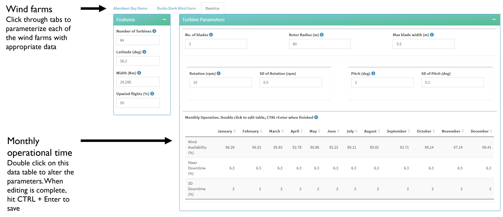

<!-- badges: start -->

<!-- badges: end -->

## mCRM R Shiny user guide  

The migration collision risk model (mCRM) shiny application is a stochastic adaptation of the Band (2012) migration collision risk worksheet.  The tool can be found at <a href="https://hidefdevo.shinyapps.io/mCRM" target="_blank">https://hidefdevo.shinyapps.io/mCRM</a> .   
The web application is a wrapper around the `r mig_stoch_crm()` function in the `{stochLAB}` package <a target="_blank" href="https://www.github.com/HiDef-Aerial-Surveying/stochLAB">https://www.github.com/HiDef-Aerial-Surveying/stochLAB</a>. The web application contains default values for 70 species of migratory birds as well as polygons that represent their approximate migratory pathways. The mCRM tool does a couple of things:
* Creates population estimates in wind farms by sampling migratory pathways via straight lines drawn between UK and non-UK coastlines
* Runs a stochastic version of the migratory collision risk model based on the population estimates and user-input parameters. 

## The main interface 

In the main interface, you'll see a couple of buttons across the header at the top. The "hamburger" (three horizontal lines) can be used to hide the sidebar. Clicking on the version number will take you to the [Github NEWS page](https://github.com/HiDef-Aerial-Surveying/mCRM/blob/master/NEWS.md). The "Github" logo (looks like a cat) will take you to the [github repo](https://github.com/HiDef-Aerial-Surveying/mCRM). And if you want to report a bug, you could click on the bug, which would take you to the [Issues page](https://github.com/HiDef-Aerial-Surveying/mCRM/issues).

In the sidebar, you will see the four steps to follow to generate your models. When you open the application, you start on Step 1: Turbine & Wind farm features, which you will see in the main display window. 

## Step 1: Turbine & Wind farm features

First choose if you want to use the built-in list of windfarm polygons, or if you want to use a custom shapefile.  
Click on the "select wind farms" input box to bring up the dropdown menu.  When the wind farms are selected, click the "update windfarm list" button.  
To delete a windfarm from the list, simply click on it and hit DELETE on your keyboard, then click the "update windfarm list" button again.  

### Using a custom shapefile

First, create a polygon shapefile that has a NAME field. Every polygon in your shapefile should have a UNIQUE identifier in the NAME field.  

  

Select the dropdown option for "custom windfarms" and then click "Browse".  
***Ensure that you select all the files associated with the shapefile*** 

Follow the steps as above to select wind farms and then update the tab list.  

### Wind farm parameters

After clicking the "Update windfarm list" button, tabs will appear on the screen. Each tab contains inputs for the parameters associated with the wind farms.  

The inputs are filled with default values but can be updated based on specifics for the wind farms. 

